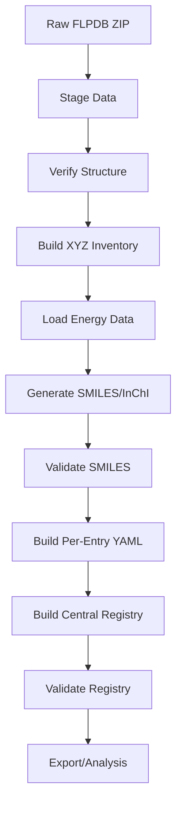

# Pipeline Documentation

This document describes the FLPCO2DB data processing pipeline and workflow.

## Overview

The FLPCO2DB pipeline transforms raw FLPDB data into a structured, queryable registry with molecular identifiers and provenance tracking.

## Pipeline Stages



## Detailed Workflow

### Stage 1: Data Staging

**Command**: `flpco2 stage` or `make stage`

**Purpose**: Extract and organize raw data from FLPDB snapshot

**Inputs**:
- `FLPDB-d549732.zip` (in project root or data/raw/)

**Outputs**:
- `data/raw/xyz/` - 133 FLP directories, 927 XYZ files
- `data/raw/graphs_csv/` - CO2.csv and other substrates
- `data/raw/html_pages/` - HTML description files
- `data/raw/flpdb_zip/` - Full extracted contents

**Verification**:
- Count FLP directories: 133 (or 134 with extras)
- Count total XYZ files: 927
- Count CO₂ XYZ files: 132
- Verify CSV files present: CO2.csv, H2.csv, etc.

**Key Functions**:
- `staging.verify_raw_data_structure()`
- `staging.build_xyz_inventory()`

### Stage 2: Registry Building

**Command**: `flpco2 build-reg` or `make build`

**Purpose**: Generate structured registry with SMILES and provenance

**Inputs**:
- `data/raw/xyz/` - XYZ geometries
- `data/raw/graphs_csv/CO2.csv` - Energy data

**Outputs**:
- `data/processed/co2_registry.yaml` - Central registry
- `data/processed/entries/<id>.yaml` - Per-FLP entries (133 files)

**Processing Steps**:

1. **Load raw data**
   - Build XYZ inventory (map files to FLP IDs)
   - Load CO2 energies from CSV
   - Find HTML pages

2. **For each FLP entry**:
   - Extract provenance (file paths)
   - Generate SMILES from XYZ (OpenBabel → RDKit)
   - Generate InChI and InChIKey
   - Validate SMILES (optional round-trip check)
   - Extract energies from CSV
   - Set QC flags
   - Write entry YAML

3. **Build central registry**:
   - Collect summary statistics
   - Create entry index
   - Record metadata (timestamp, version, source)
   - Write central YAML

**Key Functions**:
- `registry_builder.build_registry()`
- `registry_builder.build_entry()`
- `smiles_utils.infer_smiles_from_xyz()`

**Options**:
```bash
# With SMILES validation (slower, recommended)
flpco2 build-reg

# Without validation (faster, for testing)
flpco2 build-reg --no-validate

# Limited entries (for testing)
flpco2 build-reg --max-entries 10
```

### Stage 3: Validation

**Command**: `flpco2 validate` or `make validate`

**Purpose**: Verify registry integrity and expected counts

**Checks**:
- Registry file exists and is valid YAML
- Expected overlap count (≥132 entries with XYZ + energy)
- All referenced entry files exist
- QC flags are consistent
- No missing critical data

**Key Functions**:
- CLI validation logic
- Schema checks

### Stage 4: Analysis & Export

**Commands**: `flpco2 stats`, `flpco2 export`, `flpco2 inspect`

**Purpose**: Explore and export registry data

**Operations**:
- **Stats**: Show dataset statistics and coverage
- **Export**: Convert registry to CSV/JSON for analysis
- **Inspect**: View individual entry details

## Data Flow Diagram

```
FLPDB ZIP
    │
    ├─> XYZ files ──────────┐
    │                       │
    ├─> CSV files ──────────┤
    │                       ├─> Registry Builder
    └─> HTML files ─────────┘      │
                                   ├─> SMILES Generator
                                   │      │
                                   │      └─> Validation
                                   │
                                   ├─> Per-Entry YAML (133 files)
                                   │
                                   └─> Central Registry YAML
                                          │
                                          ├─> Validation
                                          │
                                          └─> Export/Analysis
```

## File Format Evolution

### Input Formats
- **XYZ**: Standard XYZ geometry files
- **CSV**: Comma-separated values with energies
- **HTML**: Description pages (not currently parsed)

### Output Formats
- **YAML**: Human-readable, preserves structure
- **JSON**: Machine-readable, for APIs (optional)
- **CSV**: Flat export for data analysis

## Restartability

The pipeline is designed to be restartable:

### Idempotent Operations
- Staging can be re-run safely
- Registry rebuild overwrites previous version
- Exports don't modify source data

### Incremental Updates
To update registry after modifications:

```bash
# Full rebuild
make clean
make build

# Or directly
rm -rf data/processed
flpco2 build-reg
```

### Partial Processing
For testing or development:

```bash
# Process only first 10 entries
flpco2 build-reg --max-entries 10

# Skip slow SMILES validation
flpco2 build-reg --no-validate
```

## Error Handling

### Data Missing
- **Missing XYZ**: Entry still created, `has_xyz_flp = false`
- **Missing energy**: Entry still created, `has_recovered_energy = false`
- **Missing both**: Entry omitted from registry

### SMILES Generation Fails
- Store `null` for failed SMILES
- Set `smiles_validation_passed = false`
- Entry still included in registry
- Check `qc_flags` to filter

### Processing Errors
- Individual entry failures logged
- Pipeline continues with other entries
- Failed entries listed in `registry['failed_entries']`

## Performance

### Timing (Approximate)

| Stage | Time (133 entries) | Notes |
|-------|-------------------|-------|
| Staging | <1 min | File operations only |
| Build (no validation) | 2-5 min | SMILES generation |
| Build (with validation) | 10-20 min | Round-trip 3D generation |
| Validation | <10 sec | File checks |
| Export | <10 sec | Format conversion |

### Optimization

For faster processing:
1. Use `--no-validate` flag
2. Test with `--max-entries 10` first
3. Use parallel processing (future enhancement)

### Bottlenecks
- SMILES round-trip validation (3D coordinate generation)
- OpenBabel subprocess calls
- RDKit 3D embedding

## Dependencies

### Required
- Python ≥3.11
- OpenBabel (SMILES generation)
- RDKit (SMILES validation, InChI)
- PyYAML (registry I/O)
- Pandas (CSV loading)

### Optional
- Rich (pretty CLI output)
- Typer (CLI framework)

## Quality Control

### Automated Checks

1. **File existence**: All referenced files exist
2. **Count validation**: Expected overlaps match
3. **YAML validity**: All files parse correctly
4. **Schema compliance**: Required fields present

### Manual Checks

Recommended periodic checks:
- Visual inspection of entries: `flpco2 inspect <id>`
- Statistics review: `flpco2 stats`
- Export and analyze: `flpco2 export -o data.csv`
- Compare with original FLPDB data

## Extending the Pipeline

### Adding New Stages

To add computational results:

1. Create results directory structure
2. Run calculations (see `02_COMPUTE_PROTOCOL.md`)
3. Update entry YAML files with results
4. Add QC flags for computed data

Example:
```yaml
# In entries/108.yaml
computed_energies:
  method: "M06-2X/def2-TZVP"
  date: "2025-11-15"
  G_bind: -8.23
  
qc_flags:
  has_computed_energies: true
```

### Adding Descriptors

1. Calculate descriptors from optimized geometries
2. Store in `data/descriptors/`
3. Reference in registry or entry files

## Troubleshooting

### "Registry not found"
```bash
make build  # or flpco2 build-reg
```

### "Missing XYZ files"
```bash
make stage  # Re-extract and organize raw data
```

### "SMILES generation slow"
```bash
flpco2 build-reg --no-validate  # Skip validation
```

### "Entry count mismatch"
- Check `data/raw/xyz/` contents
- Verify ZIP extraction completed
- Review `registry['failed_entries']`

## Integration Points

### With Jupyter Notebooks

```python
import yaml

# Load registry in notebook
with open("data/processed/co2_registry.yaml") as f:
    registry = yaml.safe_load(f)

# Process entries
for entry_ref in registry['entries']:
    # Load and analyze...
```

### With External Tools

Export to CSV for:
- Spreadsheet analysis
- R/Python data science workflows
- Machine learning pipelines

```bash
flpco2 export -o flp_data.csv
```

### With Computational Tools

```python
# Load XYZ for calculation
entry_file = "data/processed/entries/108.yaml"
with open(entry_file) as f:
    entry = yaml.safe_load(f)

xyz_path = entry['provenance']['xyz_paths']['flp']
# Use with autoDE, RDKit, etc.
```

## Best Practices

1. **Always verify after staging**: `make stage`
2. **Test on small subset first**: `--max-entries 10`
3. **Version your registry**: Tag with git or date
4. **Document modifications**: Update entry `notes` field
5. **Keep raw data immutable**: Never modify `data/raw/`
6. **Export for analysis**: Use CSV for external tools

## Future Enhancements

Potential pipeline improvements:
- Parallel processing of entries
- Incremental updates (process only new/changed entries)
- Automatic descriptor calculation
- Integration with computational backends
- Web API for registry access
- Database backend (SQLite, PostgreSQL)

## Summary

The FLPCO2DB pipeline provides:
- ✅ Automated data organization
- ✅ Molecular identifier generation
- ✅ Provenance tracking
- ✅ Quality control
- ✅ Flexible export options
- ✅ Extensibility for computations

